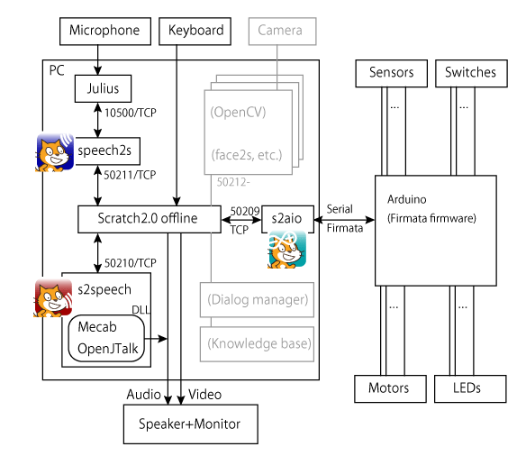

# Scratch 2.0 オフラインで使える音声対話ロボット／音声対話システム用ブロック

気軽に対話システムや対話ロボットのプロトタイプを作成するには，音声合成，音声認識，および電子回路（目が光る，頭が動く）を Scratch で使えるとよさそうです．それに，常にインターネットに接続できる環境にいるとは限らないので，すべてオフラインで行えるようにしたいところ．ここではそんな Scratch ブロックを実現するための設計方針をまとめます．

- [Scratch 2 (Offline)](https://scratch.mit.edu/download)
    - ディスプレイに表情や目の動きを作るといった細かい制御は Scratch 側で書くことになるでしょうから，関数やクローンなど，慣れた機能を利用できる Scratch 2 にします．
    - Raspberry Pi も使いたいですが，現時点では Adobe AIR が動かないので Scratch 1.4 が選択肢になります．Raspberry Pi は [Scratch 3](https://wiki.scratch.mit.edu/wiki/Scratch_3.0) になるまで少し待つことにします．
- Windows
    - 小型の Windows PC は NUC やスティック PC などいろいろ出てきているので，まずは Windows (64bit) で動くことを確認してみます．
    - ただし今後 Mac や Linux に展開できるような認識，合成エンジンを選びます．
- インストーラによる配布
    - ユーザはPython などの開発環境をインストールせずに済むよう，バイナリを配布します．（ただし Arduino IDE はインストールが必要です．）
    - 音声合成，音声認識，Arduino制御といった機能ごとにヘルパーアプリを用意し，必要なヘルパーだけインストールできるようにします．
      

    （クリックするとそれぞれの解説ページへ）

# 設計
## 拡張ブロックとヘルパーアプリ
- Scratch 2 オフライン版では，`シフト` を押しながら [ファイル] メニューを選ぶと [実験的なHTTP拡張を読み込み] を選べます．これで独自ブロックを追加できます．（一方，オンラインは JavaScript の関数で拡張しますし，Scratch 3 もおそらくその流れだと思います．）
- HTTP拡張で独自に追加したブロックは，ローカルの HTTPサーバと通信し，独自の処理や値の取得ができます．このローカルに用意する HTTPサーバは[ヘルパーアプリ (helper app)](https://wiki.scratch.mit.edu/wiki/Scratch_Extension) と呼ばれます．
- Scratch 2 が接続できるヘルパーアプリを以下のように用意し，それぞれと異なるポート番号で通信することにします．
- s2aio は [MrYsLab](https://github.com/MrYsLab)が開発したものです．これを一部アップデート（日本語化，その他）した上でインストーラを作成します．

|機能|ヘルパー名(githubへのリンク)と解説|ポート番号|ベースとなるエンジン|Scratch デモプロジェクト|
|---|---|---|---|---|
|音声合成|[s2speech](https://github.com/memakura/s2speech) [[解説]](https://github.com/memakura/s2speech/wiki)|50210/TCP|[OpenJTalk](http://open-jtalk.sp.nitech.ac.jp/) | [s2speech_demo.sb2](https://github.com/memakura/s2speech/raw/master/00scratch/s2speech_demo.sb2) |
|音声認識|[speech2s](https://github.com/memakura/speech2s) [[解説]](https://github.com/memakura/speech2s/wiki)|50211/TCP|[Julius](http://julius.osdn.jp/)|[speech2s_demo.sb2](https://github.com/memakura/speech2s/raw/master/00scratch/speech2s_demo.sb2)|
|Arduino との Firmata 通信|[s2aio](https://github.com/memakura/s2aio) [[解説]](https://github.com/memakura/s2aio/wiki)|50209/TCP|[MrYsLab作 PyMata FirmataPlus](https://github.com/MrYsLab)|[s2aio_demo.sb2](https://github.com/memakura/s2aio/raw/msi_installer/00scratch/s2aio_demo.sb2)|

ヘルパーによってはさらに別のモジュールと通信します．

- speech2s は Julius と 10500/TCP で通信
- s2aio は Arduino と COMポート/Firmataプロトコルで通信

想定するシステムの全体像は以下のような図になります．

## ヘルパーアプリの HTTP サーバは非同期 I/O ライブラリを利用
- 各ヘルパーアプリはそれぞれ別のポートでHTTPサーバを立ち上げます．
- Scratch の繰り返しループで大量にリクエストが飛んでくるかもしれません．サーバの軽量化を図るために非同期 I/O ライブラリを用います．すると，各ヘルパーアプリはシングルスレッドでありながら，複数のHTTPリクエストをコルーチンにより非同期並列処理できるようになります．
- 実際，MrYsLab の s2aio は Python の [asyncio](https://docs.python.jp/3/library/asyncio.html) をベースにした [aiohttp](http://aiohttp.readthedocs.io/en/stable/) を用いています．

## 開発言語およびバージョンの選択
- asyncio を利用し，かつ後々に OpenCV を組み込むことを考えると，Python や C# がよい候補となります．
- s2aio の開発で Python が使われていることや，インストーラの作成が簡単なことから Python を開発言語とします．
- asyncio の async/await は3.5以上，OpenCV が安定に動くのは3.5以下であるため，Python 3.5 を利用します．
- インストーラ (msi) の生成には [scratio](https://lets.makewitharduino.com/sample/scratch/) に倣い [cx_Freeze](https://anthony-tuininga.github.io/cx_Freeze/) を利用します．

## ブロック記載の漢字
- ユーザは小3-4年の漢字が読める子供から広く想定します．
- 一部はあえてひらがなとせず，小5-6年習得の漢字を使用します．（「無効」，「品詞」など）
- 必要があれば，全体をひらがなにしたブロックも後ほど加えることにします．

## 各ヘルパーアプリの説明
### **s2speech (OpenJTalk)**
 

#### 機能
- テキストを入力すると音声を合成します．
- OpenJTalkとMecab のDLLを利用します（[NVDA日本語版で用いられている python ラッパーを一部利用](https://github.com/nvdajp/python-jtalk)）．

#### 使用方法へのリンク
- 解説: https://github.com/memakura/s2speech/wiki
- 開発ページ: https://github.com/memakura/s2speech

#### ブロックの設計
- 再生を待たずに次へ進む `[...]と話す` と，再生を待つ `[...]と話す(終わるまで待つ)` の二種類のブロックを用意します．
    - 前者の**待たない**ブロックを使うことで，話しながら口パクすることができます．
- 使い方の詳細な例は[デモプロジェクト(s2speech_demo.sb2)](https://github.com/memakura/s2speech/raw/master/00scratch/s2speech_demo.sb2)にまとめます．

#### 拡張性
- 声は数種類のみとし，あとは hts 形式で自由に追加できるようにします．
- 追加の hts ファイルはユーザにアクセス権限のあるユーザ領域に置けるようにします．

### **speech2s (Julius)**
 

#### 機能
- 音声をテキストに変換します．
- [Julius のモジュールモード](https://julius.osdn.jp/juliusbook/ja/desc_module.html)と通信して結果を取得します．

#### 使用方法へのリンク
- 解説: https://github.com/memakura/speech2s/wiki
- 音声認識ではマイクの設定が重要になるため，Bluetooth ヘッドセットの使用方法などと合わせてまとめます．
    - [音声入力デバイス（マイク）の設定](https://github.com/memakura/speech2s/wiki/SetInputDevice)
- 開発ページ: https://github.com/memakura/speech2s

#### ブロックの設計
- `聞こえた言葉` のブロックには，`聞こえるまで最大(...)秒待つ` のブロックがトリガーになって認識結果が入ります．
- 一方で，`耳に入った言葉` には常に（連続的に）認識結果が入ります（Juliusの連続音声認識）．
    - 連続認識によって，認識開始のトリガーが無くても「起きて」といったキーワードへ反応できます．
- 品詞への分解も行われているため，これを Scratch でも使えるようにします．
    - Scratch2では連想配列がないため，各品詞をループ等で順に調べるために `品詞#`（品詞番号）を使います．
    - 各`品詞#` がどの品詞に対応するかを返すブロックとして `品詞#(...)の名前` を用意します．
    - さらに，品詞番号でループを回すときのために，品詞番号の最大を `品詞の数` で取れるようにします．
- 使い方の詳細な例は[デモプロジェクト(speech2s_demo.sb2)](https://github.com/memakura/speech2s/raw/master/00scratch/speech2s_demo.sb2)にまとめます．

#### 拡張性
- 音響モデルは深層学習 (Deep Neural Network) で学習された DNN モデルと差し替え可能ですが，サイズが大きいためインストーラからは外します．
    - つまりインストーラから利用できるのは GMM モデル（混合ガウス分布, Gaussian Mixture Model）です．
    - DNN モデルはリポジトリには置いてあるので，Python をインストールして用いることができます．
- そういえば [HARK](http://www.hark.jp/document/hark-document-ja/) に [Kaldi](https://github.com/kaldi-asr/kaldi) の [Julius のモジュールモード的インタフェース](http://www.hark.jp/document/hark-document-ja/subsec-KaldiDecoder.html)があったかもしれず，それを用いることができるのかもしれません．（未確認）

### **s2aio (Arduino)**

 

#### 機能
- Arduino とデジタル／アナログ値の入出力ができます．
- サーボも対応しています．
- [Firmata プロトコル](https://github.com/firmata/protocol)を用いてます．

#### 使用方法へのリンク
- 解説: https://github.com/memakura/s2aio/wiki
- 開発ページ: https://github.com/memakura/s2aio
- MrYsLab によるオリジナルの開発ページ: https://github.com/MrYsLab/s2aio
- オリジナルに対する主な変更点
    - ブロックの日本語化
    - aiohttp の使用バージョン変更(0.22.4 -> 2.1.0) に伴う修正
    - インストーラ用コード，アイコン追加

#### ブロックの設計
- [オリジナルの s2aio におけるブロックの設計](https://github.com/MrYsLab/s2aio/wiki/s2aio-Programming-Blocks) とします．
- s2aio の前身となる [s2_fm](https://github.com/MrYsLab/s2a_fm) では，日本語化の際に日本語の語順に合わせて HTTP GET のパラメタ順序を入れ替えるような拡張がされましたが，s2aio ではひとまず英語のままの順序とします．
    - ピンのモード設定（有効化と無効化）がやや不自然ですが，`有効化` や `無効化` といったキーワードが前にあったほうが間違えにくいかもしれない，という判断です．
    - 「有効化」や「無効化」という用語がやや専門的かとも思いましたが，広く使われているのでそのままにします．

#### 拡張性
- 内部的には Sonar が実装されているため，距離センサのブロックを追加できるかもしれません．
